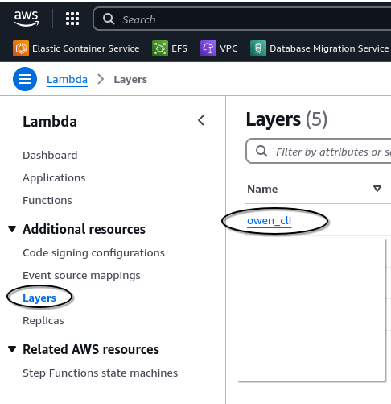
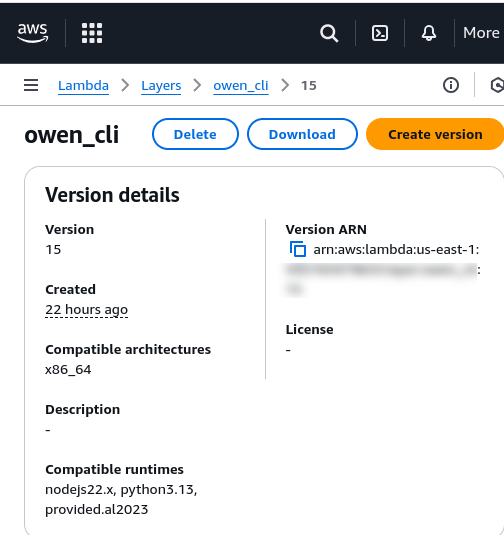

# OWEN - Original Works Electronic Notifications

This is still a prototype on v0.1

Current status is reported on issues [v0.1](https://github.com/originalworks/protocol/issues/73) and [v0.2](https://github.com/originalworks/protocol/issues/74)

You can currenlty use OWEN to send `.xml` files as a BLOB using [EIP4844](https://www.eip4844.com/) transaction.

# HOW TO USE OWEN WITH LIVE TESTNET (Holesky)

#### To run OWEN on Holesky, you'll need four things:

1. **RPC endpoint URL**: This should point to the Holesky blockchain network. You can get one for free from most RPC providers like Alchemy, Chainstack, QuickNode, etc.
2. **IPFS client**: in the current implementation, we support two solutions:

   - **Pinata's JWT Token**: You can get one for free here: [Pinata](https://pinata.cloud/) / [API keys](https://docs.pinata.cloud/account-management/api-keys)
   - **IPFS Kubo client endpoint URL with exposed [API V0](https://docs.ipfs.tech/reference/kubo/rpc/)**: For testing purposes, you can run it locally with the following Bash command from the project root folder: `docker compose -f ./docker/run-local.yml up ipfs`. For production environments, you should run a full version on your server or in the cloud.

3. **Private key of your wallet** with funds on Holesky testnet
4. **Folder with your DDEX messages in xml format**: Each message should be in a separate subfolder and include an image file. You can use our test files from the `owen/tests/msg_one` and `owen/tests/msg_two` folders, but remember to change some values because the Protocol prevents sending identical BLOBs twice.

## Steps to Get Started

### 1. Clone this repository:

```bash
git clone https://github.com/originalworks/protocol-core && cd protocol-core
```

### 2. Create `.env` file:

Use the `.env.example` file to create your `.env` file:

```bash
cp ./owen/.env.example ./owen/.env
```

### 3. Edit the following values in the `/owen/.env` file:

- `PRIVATE_KEY`: Your private key.
- `RPC_URL`: Your RPC endpoint URL pointing to Holesky.
- If you've chosen Pinata as your IPFS client, edit these values:
  - `PINATA_JWT`: Your Pinata JWT token.
  - `DEFAULT_IPFS_INTERFACE`: Change the value from `KUBO` to `PINATA`.
- If you are running a local Kubo IPFS client with Docker, no changes are needed. However, if you run your own full IPFS Kubo client, update this value:
  - `IPFS_KUBO_URL`: Your Kubo IPFS client API URL.
- `OUTPUT_FILES_DIR`: Path were output files will be saved

### 4. Prepare your messages folder:

Inside the `/owen` directory, create a folder with your messages structured as follows:

```
-> my_messages
    -> message_one
        -> message_resources
            image_file.png
        your_ddex_msg.xml
    -> message_two
        -> message_resources
            image_file.jpg
        your_ddex_msg.xml
```

- Owen will look for a string with a file path in the `ResourceList.Image.TechnicalDetails.File.URI` tag in each message. If it finds it, it pins the file to IPFS. Then it replaces the `ResourceList.Image.TechnicalDetails.File.URI` tag value with the CID of the pinned file.
- Directory and file names don't matter.
- DDEX messages have to be in `.xml` format.

### 5. Run OWEN:

```bash
cd owen && cargo run ./my_messages
```

As an output you should receive the list of processed messges from the `./my_messages` directory with the images files that were pined and the receipt of the transaction.
Example output:

```
    Finished `dev` profile [unoptimized + debuginfo] target(s) in 0.17s
     Running `target/debug/owen ./tests`
PROCESSED DDEX MESSAGE:
Source files: image: ./tests/asset_one/image-asset.png; XML: ./tests/asset_one/test.xml
Image file ./tests/asset_one/image-asset.png was pined to IPFS under CID: QmZ9zbXsBffafmAJSKtRXh6EZfChc1rgNR6JEJc92ZmWkS
CID: QmZ9zbXsBffafmAJSKtRXh6EZfChc1rgNR6JEJc92ZmWkS was included in the output file: ./output_files/1.xml
----------
PROCESSED DDEX MESSAGE:
Source files: image: ./tests/asset_two/random-image.avif; XML: ./tests/asset_two/name.xml
Image file ./tests/asset_two/random-image.avif was pined to IPFS under CID: QmXvR6x7tF6RcgPD51zmS2Y1pjNVquWynreC63iRpTTRsd
CID: QmXvR6x7tF6RcgPD51zmS2Y1pjNVquWynreC63iRpTTRsd was included in the output file: ./output_files/4.xml
----------
sending tx...
TransactionReceipt { inner: Eip4844(ReceiptWithBloom { receipt: Receipt { status: Eip658(true), cumulative_gas_used: 101145, logs: [Log { inner: Log { address: 0x00c042c4d5d913277ce16611a2ce6e9003554ad5, data: LogData { topics: [0x6a6fc970009454e3172a2ec189981caa44b6d81bfc3a7ba62cf8367df4aecf75], data: 0x00000000000000000000000000000000000000000000000000000000000000200000000000000000000000000000000000000000000000000000000000000030a4e5158df6997b07c5781ed92225804d23da8ce76fefca0a0d5624cbb4e0779cad21e842c254216297b571bcd8b9534100000000000000000000000000000000 } }, block_hash: Some(0xe2b754bb58d6f27c95b9a42ddf10be75d60255a3e459bd5de9d6c2e9bc22c487), block_number: Some(462), block_timestamp: None, transaction_hash: Some(0xc73b1a70f9d446ab04433b9bcc3ba95849ea9f35e35cd3ece9cc7d8ab2ddcc33), transaction_index: Some(0), log_index: Some(0), removed: false }] }, logs_bloom: 0x00000000000000000000000000000000000000000000000000000000000000000000000000000000000000000000000000000000000000000000000000000000000000000000000000040000000000000000000000000000000000000000000000000000000000000000000000000000000000000000000000000000000000000000000000000000000000000000000800000000000000000000000000000000000800000000000000000000000000000000000002000080000000000000000000000000000000000000000000000000000000000000000000000000000000000000000000000000000000000000000000000000008000000000000000000000 }), transaction_hash: 0xc73b1a70f9d446ab04433b9bcc3ba95849ea9f35e35cd3ece9cc7d8ab2ddcc33, transaction_index: Some(0), block_hash: Some(0xe2b754bb58d6f27c95b9a42ddf10be75d60255a3e459bd5de9d6c2e9bc22c487), block_number: Some(462), gas_used: 101145, effective_gas_price: 100000000, blob_gas_used: Some(131072), blob_gas_price: Some(1), from: 0x802dcbe1b1a97554b4f50db5119e37e8e7336417, to: Some(0x00c042c4d5d913277ce16611a2ce6e9003554ad5), contract_address: None, state_root: None, authorization_list: None }

```

### 6. Cleanup after testing:

```bash
docker compose -f ./docker/run-local.yml down
```

<br>

<br>

<br>

# HOW TO USE OWEN WITH LOCAL TESTNET

### 1. Install and run kurtosis testnet:

1. Install `kurtosis` by following the instruction from [HERE](https://docs.kurtosis.com/install)
2. Run the testnet with `kurtosis --enclave local-eth-testnet run github.com/ethpandaops/ethereum-package`
3. Run the following command to get the RPC of the testnet network you just created.

```bash
$ kurtosis port print local-eth-testnet el-1-geth-lighthouse rpc

127.0.0.1:32769
```

Prefix it with `http://` and save it for later steps

### 2. Clone this repository and enter its directory

```bash
git clone https://github.com/originalworks/protocol-core && cd protocol-core
```

### 3. Run IPFS local node:

```bash
docker compose -f ./docker/run-local.yml up ipfs -d
```

### 4. Create `.env` files from `.env.example`

```bash
cp ./owen/.env.example ./owen/.env && cp ./contracts/.env.example ./contracts/.env
```

### 5. Edit `/contracts/.env` and `/owen/.env` files:

- Change the `RPC_URL` value in both files with your local testnet RPC URL.

### 6. Compile and deploy contracts

1. Inside the `/contracts` folder run:

```bash
npm i
npx hardhat compile
npx hardhat run scripts/execute/deployLocal.ts --network kurtosis_testnet
```

The last command may take some time to complete. Once it's done, it will return output with the addresses of validators, data providers and smart contracts. Similar to this:

```
deployment data: {
  ddexSequencer: '0x00c042C4D5D913277CE16611a2ce6e9003554aD5',
  accounts: {
    deployer: '0x8943545177806ED17B9F23F0a21ee5948eCaa776',
    validators: [
      '0xE25583099BA105D9ec0A67f5Ae86D90e50036425',
      '0x614561D2d143621E126e87831AEF287678B442b8'
    ],
    dataProviders: [
      '0xf93Ee4Cf8c6c40b329b0c0626F28333c132CF241',
      '0x802dCbE1B1A97554B4F50DB5119E37E8e7336417'
    ]
  },
  whitelists: {
    dataProvidersWhitelist: '0xb4B46bdAA835F8E4b4d8e208B6559cD267851051',
    validatorsWhitelist: '0x422A3492e218383753D8006C7Bfa97815B44373F'
  }
}
```

2. Copy `ddexSequencer` address without the `0x` and update the `DDEX_SEQUENCER_ADDRESS` value in the file `owen/src/constants.rs`.

### 7. Send messages from /tests folder

```bash
$ cd owen && cargo run ./tests
```

### 8. Cleanup after testing:

```bash
kurtosis enclave stop local-eth-testnet

kurtosis clean

docker compose -f ./docker/run-local.yml down
```


# HOW TO RUN OWEN AS AL LAMBDA LAYER ON AWS

1. Clone this repository with its submodules `git clone -recurse-submodules https://github.com/originalworks/protocol-core`
2. Make bundle of owen by running `/owen/bundle.sh` that will generate a file named `owen_cli.zip`.
3. Log into AWS Console, and go to Lambda -> layers -> owen_cli:

4. Click on Create version:

5. Upload the newley generated file`owen_cli.zip

