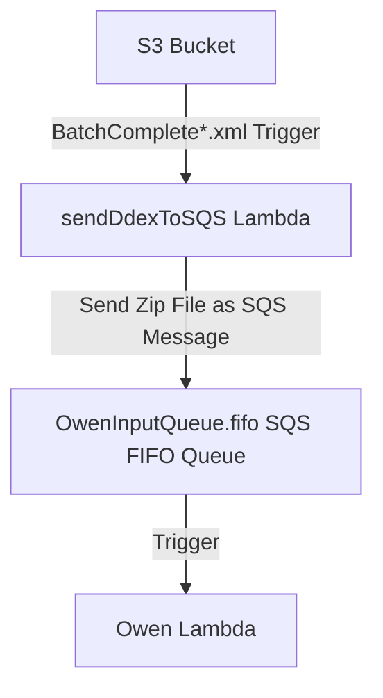
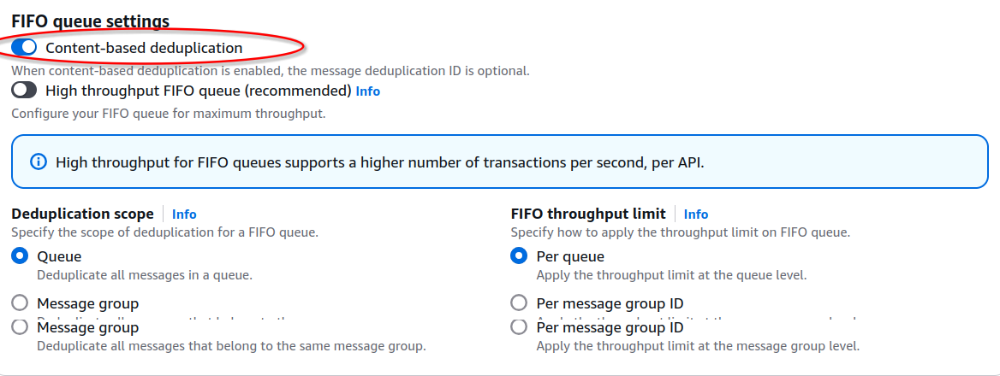

# Deploying the DDEX Processing Pipeline on AWS

This guide will walk you through deploying a DDEX processing pipeline on your AWS account. The architecture consists of:
- An S3 bucket (`ddex-messages-prod`) for uploading DDEX files.
- A Lambda function (`sendDdexToSQS`) to process uploaded files.
- An SQS FIFO queue (`OwenInputQueue.fifo`) to manage zip file delivery.
- A Lambda function (`Owen`) to process the zip files from the queue.

## Prerequisites

1. AWS CLI installed and configured.
2. Python 3.9+ installed for Lambda functions (or another runtime if preferred).
3. Sufficient IAM permissions to create resources on AWS.

---




---

## Steps to Deploy

### 1. Create the S3 Bucket
1. Open the AWS S3 Console.
2. Create a new bucket:
   - **Bucket Name**: `ddex-messages-prod`
   - **Region**: Select your preferred AWS region.
   - Enable versioning (optional).
3. Add a folder structure as needed for DDEX uploads.

---

### 2. Create the SQS FIFO Queue
1. Open the AWS SQS Console.
2. Create a new FIFO queue:
   - **Name**: `OwenInputQueue.fifo`
   - **Message Deduplication**: Enable (using content-based deduplication).


   - **Add the following Access polcicy JSON**. replacing REGION, ACCOUNT_ID and LAMBDA_FUNTION_ARN for your own values. 
```json
    {
  "Version": "2012-10-17",
  "Id": "PolicyForOwenInputQueue",
  "Statement": [
    {
      "Sid": "AllowSendMessageFromLambda",
      "Effect": "Allow",
      "Principal": {
        "Service": "lambda.amazonaws.com"
      },
      "Action": "sqs:SendMessage",
      "Resource": "arn:aws:sqs:<REGION>:<ACCOUNT_ID>:OwenInputQueue.fifo",
      "Condition": {
        "ArnEquals": {
          "aws:SourceArn": "<LAMBDA_FUNCTION_ARN>"
        }
      }
    }
  ]
}

```
Example values can be:
`REGION`: us-east-1
`ACCOUNT_ID`: 123456789012
`LAMBDA_FUNCTION_ARN`: "arn:aws:lambda:us-east-1:123456789012:function:sendDdexToSQS"

---

### 3. Create the `sendDdexToSQS` Lambda Function
1. Open the AWS Lambda Console and create a new Lambda function:
   - **Name**: `sendDdexToSQS`
   - **Runtime**: Python 3.9+.
   - **Architcture**: x86_64
   - **Permissions**: Attach an IAM role with the following policies:
     - `AmazonS3ReadOnlyAccess`
     - `AmazonSQSFullAccess`

2. Add the following code to the function:
Replace YOUR_SQS_QUEUE_URL with the URL of the OwenInputQueue.fifo.

Deploy the function
